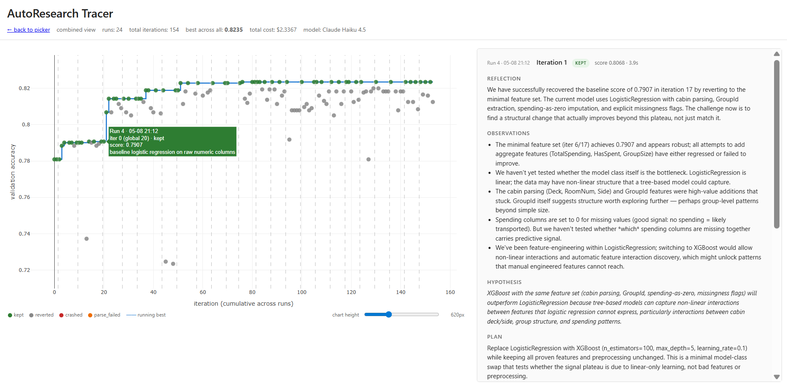

# Spaceship Titanic AutoResearch



An autoresearch loop that lets Claude Haiku 4.5 iteratively improve a sklearn
training script for the
[Spaceship Titanic](https://www.kaggle.com/competitions/spaceship-titanic)
Kaggle problem. Each turn, the agent reads its current `train.py`, the
research brief, recent iteration history, and proposes one concrete change.
The harness writes the new code, commits it, runs the script with a 60-second
timeout, ratchets on success and reverts on failure, and appends a JSONL
record. A single-file HTML viewer reads those JSONL traces and lets you click
through to inspect any iteration.

The pattern is from Karpathy's autoresearch idea (see
[this tutorial](https://www.datacamp.com/tutorial/guide-to-autoresearch)).
The companion blog post is at [One Agent, 154 Experiments](https://rogereo.github.io/2026/05/16/autoresearch-tracer/) 

Across 24 sessions and 154 iterations I spent $2.34 and reached 0.8235
validation accuracy. The 24 trace files are committed in `traces/`.

## Setup

1. Clone the repo and `cd` into it.
2. Create and activate a virtual environment:
   ```powershell
   python -m venv .venv
   .\.venv\Scripts\Activate.ps1
   ```
3. Install dependencies:
   ```
   pip install -r requirements.txt
   ```
4. Copy `.env.example` to `.env` and add your Anthropic API key. Set a hard
   spending cap on the key in the Anthropic console.
5. Download `train.csv` from the
   [Kaggle competition](https://www.kaggle.com/competitions/spaceship-titanic/data)
   and place it at `data/train.csv`.

## Run the loop

```
python orchestrator.py
```

Each run creates a fresh branch `autoresearch/run-<timestamp>`, writes one
JSONL line per iteration to `traces/run_<timestamp>.jsonl`, and stops at 15
iterations, $10 cost, or 5 consecutive iterations without improvement.
Reverted iterations are hard-reset out of git history; the kept ones form a
clean staircase.

To start a run from the original baseline rather than the current
`workspace/train.py`:

```
copy workspace\train.py.starter workspace\train.py
```

## View a trace

Serve the repo:

```
python -m http.server --bind 127.0.0.1
```

Then open <http://localhost:8000/>. The viewer auto-discovers files in
`traces/`. With many traces it shows a picker; you can also link to a
specific run, e.g.

```
http://localhost:8000/?trace=traces/run_20260508_230657.jsonl
```

or to the combined view across all runs:

```
http://localhost:8000/?combined=1
```

The chart plots validation accuracy per iteration. Green dots are kept,
grey reverted, red crashed, orange parse-failed. The blue staircase is the
running best. Click any dot to expand the full iteration record:
reflection, observations, hypothesis, plan, code, stdout, stderr, and notes
appended.

## Generate a Kaggle submission

Place the test data alongside `train.csv`:

- `data/test.csv` — the hidden test set.
- `data/sample_submission.csv` — the expected format.

Then:

```
python submit.py
```

It reproduces the held-out validation score for sanity, retrains on the full
labelled set, predicts on `test.csv`, validates the row set against
`sample_submission.csv`, and writes `submission.csv` at the repo root. Upload
that file at <https://www.kaggle.com/competitions/spaceship-titanic/submit>.

## How it's wired

Three parts, kept decoupled:

- **The orchestrator** ([`orchestrator.py`](./orchestrator.py)) —
  orchestrates the loop. Reads files, calls the API, executes code,
  ratchets, writes the trace.
- **The problem definition** —
  [`prepare.py`](./prepare.py) is the immutable evaluator (fixed 80/20
  split, seed 42).
  [`workspace/train.py`](./workspace/train.py) is the agent's sandbox,
  rewritten each turn — the version committed here is the one that scored
  0.8235.
  [`program.md`](./program.md) is the human-authored research brief the
  agent reads every turn.
- **The output view** — [`index.html`](./index.html) reads a JSONL trace
  via `fetch()` and renders the chart and detail panel. Each `.jsonl` file
  in [`traces/`](./traces/) is one full session.

The harness reads JSONL. The viewer reads JSONL. They share no imports.

## Hard rules (enforced by the harness)

- `train.py` must call `prepare.evaluate(predict_fn)` exactly once and
  print `VAL_ACCURACY: 0.XXXX` as the last line of stdout.
- 60-second per-iteration timeout; longer runs are killed and reverted.
- Score regressions are reverted via `git reset --hard HEAD~1`.
- $10 total cost cap per run.
- The agent may only use `pandas`, `numpy`, `scikit-learn`, `xgboost`,
  `lightgbm`. No internet, no new dependencies.
- The agent may not modify `prepare.py`.
